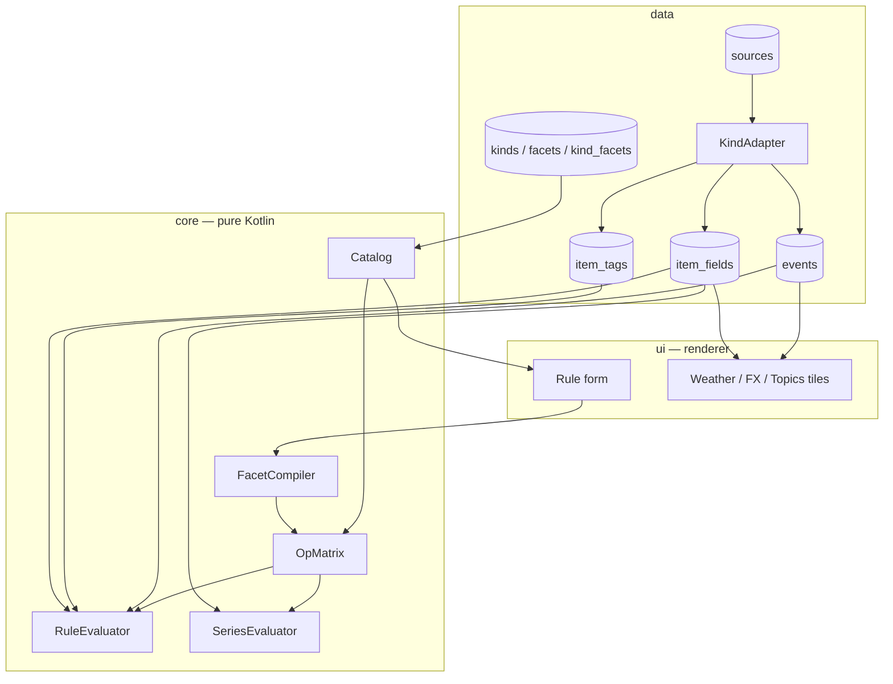
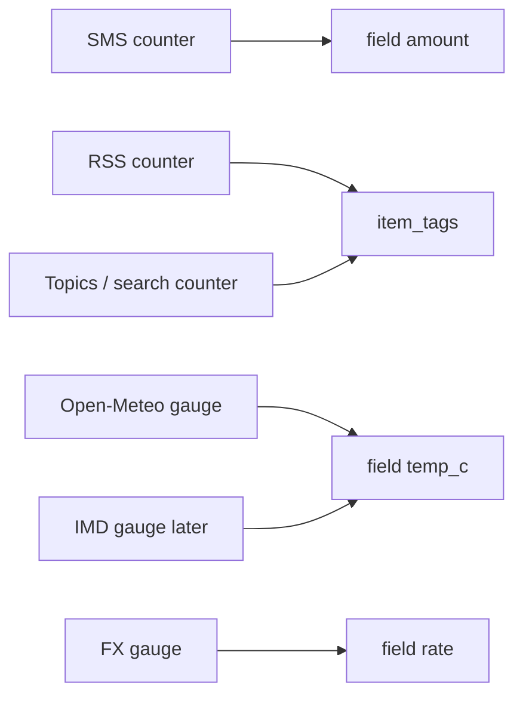

# ADR 0005: Facet catalog, typed measures, observation ingest

- Status: Accepted
- Date: 2026-09-17
- Review-by: 2026-12-17
- Owners: @alexday
- Tags: [rules, catalog, ingest, measures]

## Summary

Rule authoring is Field / Op / Value over a **catalog**, not hardcoded
keys. Stored condition JSON (`subject`, `nature`, `marker`, `source`,
`field`, `text`, `all`/`any`, series leaves) stays. A pure-Kotlin catalog
owns facet id, value type, measure kind (counter / gauge / histogram), and
allowed ops. Producer **descriptors** are seeded data; **adapters** are
code. `kind` is a string, not an enum. Topics (Google News today) is kind
`search`. Gauges write `events` + `item_fields`; tiles and rules read that
store — one owner. Counters `INSERT OR IGNORE`; gauges upsert-by-bucket.
UI only renders catalog + draft.

## Decision Boundary & Invariants

1. On-disk `Condition` JSON is unchanged; previously saved rules still parse and evaluate.
2. Subject, nature, and marker stay leaves compiled from catalog facets; they live on `item_tags` and `TagGroups`, never as `item_fields`.
3. `core/catalog`, `core/rules`, and measure types import no `android.*`. Compose, Room, and WorkManager stay outside core.
4. Each facet has one `ValueType` and one `MeasureKind`. Ops are a closed engine set; a facet selects a subset. No type coercion at write or match.
5. A missing field is not a match, including `ne`. Unimplemented measure ops throw a typed exception, never return `false`.
6. **One fact, one owner.** `events` plus sidecars are the only facts. Tiles, dry-run, and rules read the store. An HTTP cache inside an adapter is fetch implementation, not a second corpus.
7. `kind` is a **string**. A new instance is a `sources` row. A new kind is a `KindAdapter` plus seed rows. Evaluator, OpMatrix, and form never switch on kind. The `SourceKind` enum is retired as validator.
8. `sources.id` is the registry key. `events.source` is the matcher identity. They are not the same string. `KindAdapter.identity` is the one mapping. Rules store `events.source`.
9. Any `Tagger` writes `item_tags`; readers use `item_tags_current`. An ML tagger is a substitutable implementation.
10. Observation kinds are not enrichable. `ArticleEnricher` skips `type=observation` (and any kind with `enrichable=false`).
11. Item rules run on `RuleEvaluator`. Series rules run on `SeriesEvaluator`. Ingest of a gauge sample must run both paths as applicable — never call the item evaluator on a series condition (that throws), never skip series rules.
12. `Field` `gt`/`lt` is a **level**. `Crossing` is an **edge** (the window contains a sample on one side of the threshold and a later sample on the other). A window already entirely above the threshold is not a crossing.

## Context & Forces

- SMS, RSS, and Topics write `events`. Weather and FX only fill a UI cache. Rules cannot match temperature or rates, and the number has two owners.
- The form mock is generic Field / Op / Value. The live builder hardcodes predicate kinds and `FieldNames`.
- The weather tile is already a view (forecast + items tagged `weather`). SMS alerts and IMD must join that view, not a new engine.
- Topics is a source (kind `search`, one instance per query). Google News is the provider in `spec_json`, not a kind.
- Counters, gauges, and later histograms must share one op matrix so `text gt 1` cannot happen.
- `SourceKind { RSS, SEARCH }` plus `SourceSpecs.parse` throwing on anything else blocks weather/fx/sms/device.
- On-device, offline, no `eval`, no CEL.

Non-goals: replacing subject/nature/marker; producer-defined operators; implementing histogram evaluation or windowed `count`; putting Compose in core; rewriting the heuristic tagger; push delivery / quiet hours / frequency (action_json stays `delivery` + `position`).

## Options & Tradeoffs (Matrix)

| Option | Reliability | Complexity | Cost | Time-to-Value | Notes |
|---|---|---|---|---|---|
| A (chosen): catalog compiles to existing Condition | ✅ | ◑ | low | ✅ | JSON stable; UI generic |
| B: new `{fact,op,value}` language | ✅ | high | rewrite | slow | breaks stored rules |
| C: per-kind leaves (`weather`, `fx`) | ◑ | grows | low now | fast | every producer opens the engine |
| D: CEL / JsonLogic strings | ◑ | high | runtime | medium | not form-buildable |

## Architecture (happy path & failures & edge cases)



Happy path: seeder writes kinds/facets/instances → adapter fetches (may cache HTTP) and writes `events` + sidecars → tiles observe the store → builder lists `catalog.facets(topics)` → compiler emits condition JSON → writer validates via OpMatrix → on ingest, item rules use `RuleEvaluator`, series rules use `SeriesEvaluator`.



| Failure | Behaviour |
|---|---|
| Unknown facet at write | `IllegalArgumentException`, no rule row |
| `str` + `gt` | OpMatrix rejects |
| Histogram / `count` op | `MeasureUnsupportedException` |
| Series op on counter facet | rejected at write |
| Series op on item evaluator | `SeriesPredicateUnsupportedException` |
| Same gauge bucket re-polled | one observation, same ulid, latest value |
| Duplicate counter `dedupe_key` | IGNORE; fields frozen |
| Tagger throws | event stored, untagged |
| Kind in DB, no adapter | skip ingest, log |
| Enricher sees `type=observation` | skip |
| Crossing window already all above threshold | false (not an edge) |
| Gap inside series window | crossing/delta do not fire |

### Engineering Standards

- **Type safety:** public catalog APIs explicitly typed; sealed measure and value types.
- **Testing:** each `REQ-*` is a unit test; core tests are JUnit with no Robolectric.
- **Layering:** UI does not own keys, ops, or validation. Data does not import `ui/`.
- **Open/Closed:** new kind = new `KindAdapter` + seed rows. No `when (kind)` in evaluator, catalog, or form.
- **Liskov:** `Catalog`, `KindAdapter`, `Tagger` honour every input; unsupported measures throw.
- **ISP:** `Catalog` (read) ≠ `KindAdapter` (ingest). UI depends on `Catalog` + `FacetCompiler` only.
- **Code quality:** `ktlintCheck` + unit tests per task.

## Contracts & Interfaces

Package `com.personalos.app.core.catalog` — zero Android.

```kotlin
enum class ValueType { NUM, STR, ENUM, FLAG }
enum class MeasureKind { COUNTER, GAUGE, HISTOGRAM }
enum class IngestGrain { ITEM, SERIES }

data class Facet(
    val id: String,
    val valueType: ValueType,
    val measure: MeasureKind,
    val ops: Set<String>,
    val valuesFrom: ValuesFrom?,
)

data class Kind(
    val id: String,
    val grain: IngestGrain,
    val topics: Set<String>,
    val facetIds: Set<String>,
    val enrichable: Boolean,
)

interface Catalog {
    fun kind(id: String): Kind?
    fun facet(id: String): Facet?
    fun facetsForTopics(topics: Set<String>): List<Facet>
    fun kindsForTopic(topic: String): List<Kind>
}

object OpMatrix {
    fun allowed(facet: Facet, op: String): Boolean
    fun require(facet: Facet, op: String, value: FieldValue)
}

object FacetCompiler {
    fun toCondition(clause: FacetClause): Condition
}

interface KindAdapter {
    val kindId: String
    fun parseSpec(json: String): SourceSpec
    fun identity(source: SourceEntity): String
    suspend fun ingest(source: SourceEntity, now: Long): Int
}
```

`FacetClause` is `{facetId, op, value}`. Compiler is the only place that maps `subject` / `nature` / `marker` onto those leaves.

`KindAdapter.identity` returns `events.source` (e.g. `gnews:west-bengal`, `weather:bengaluru`). It must not return `sources.id` (`seed:search:west-bengal`).

Compat: condition JSON forward-compatible; catalog is additive. Unknown facet at **write** fails; old JSON without new facets still evaluates.

### Measure kinds

| Kind | Store pattern | Item ops | Window ops now | Reserved |
|---|---|---|---|---|
| counter | one event per occurrence | eq ne lt lte gt gte / contains on fields | none | `count` |
| gauge | one event per sample | numeric item ops (level) | crossing (edge), delta, min, max | — |
| histogram | none yet | none | none | p50 p95 |

`amount` is a num **field on a counter event**, not a gauge — `gt` yes, `crossing` no. `temp_c` is a num **gauge** — item `gt` is a level; `crossing` is an edge. Open-Meteo and IMD share facet id `temp_c`; they differ by `source`.

`IngestGrain` is the write axis; `MeasureKind` is the read axis. ITEM ↔ COUNTER, SERIES ↔ GAUGE; histogram is series-written, read differently. Do not collapse the two enums.

**Level vs edge**

- `{"field":{"name":"temp_c","op":"gt","value":40}}` — this sample is above 40. Fires on every matching sample (ingest + dry-run). Delivery throttle is out of scope.
- `{"crossing":{"field":"temp_c","direction":"above","value":40,"window":N}}` — some earlier sample in the window is ≤ 40 and a later one is > 40. A window of `[41, 42, 43]` is **not** a crossing.

### Data model

```sql
kinds (
  id TEXT PRIMARY KEY,
  mode TEXT NOT NULL,
  topics TEXT NOT NULL,
  enrichable INTEGER NOT NULL,
  seeded INTEGER NOT NULL,
  created_at INTEGER NOT NULL
);

facets (
  id TEXT PRIMARY KEY,
  value_type TEXT NOT NULL,
  measure TEXT NOT NULL,
  ops TEXT NOT NULL,
  values_from TEXT,
  seeded INTEGER NOT NULL,
  created_at INTEGER NOT NULL
);

kind_facets (
  kind_id TEXT NOT NULL,
  facet_id TEXT NOT NULL,
  PRIMARY KEY (kind_id, facet_id)
);
```

| Table | Counter fill | Gauge fill |
|---|---|---|
| `events` | SMS / RSS / Topics as today | `type=observation`, `source` = adapter identity |
| `item_tags` | tagger | topic tag (`weather` / `finance`) so tile joins work |
| `item_fields` | amount, sender | temp_c, rain_mm, rate |
| `mentions` | as today | place when known |
| `sources` | one row per instance | one row per place or pair |

No weather-specific table. Histogram on-disk format is not specified here.

Series window read (indexed, not a full scan):

```sql
SELECT f.value_num, e.timestamp
FROM item_fields f
JOIN events e ON e.ulid = f.item_id
WHERE e.source = :sourceId AND f.name = :field
ORDER BY e.timestamp DESC
LIMIT :n
```

### Kinds, instances, adapters — not a static `SourceKind`

`sources.kind` is a **string**. The closed Kotlin enum `SourceKind { RSS, SEARCH }` and `SourceSpecs.parse` throwing on anything else are **retired**.

| Add | What you write | Code change? |
|---|---|---|
| **Instance** of a known kind | one `sources` row (`kind` + `spec_json` + interval) | none |
| **Kind** the app cannot ingest yet | `KindAdapter` + seed rows in `kinds` / `facets` / `kind_facets` | adapter + bind in `AppContainer` |

Bound as `Map<String, KindAdapter>`. Unbound kind → skip ingest, not a crash.

**Day-one kinds (strings, seeded):**

| `kind` | UI name | Instance | `sources.id` (registry) | `events.source` (identity) | Grain | Enrich |
|---|---|---|---|---|---|---|
| `sms` | SMS | exactly one | `sms` | `sms` | counter | no |
| `rss` | Feeds | one publisher feed | `seed:rss:…` / user ULID | `rss:<feed id>` / `userrss:<id>` | counter | yes |
| `search` | **Topics** | one query | `seed:search:west-bengal` | `gnews:<slug>` | counter | yes |
| `weather` | — (tile is a view) | one place | `seed:weather:bengaluru` | `weather:bengaluru` | gauge | no |
| `fx` | — (tile is a view) | one pair | `seed:fx:usd-inr` | `fx:usd-inr` | gauge | no |
| `device` | — | one signal | `seed:device:battery` | `device:battery` | gauge | no |

Topics is a source kind. “West Bengal” is an **instance** of `search`. Google News is the provider in `spec_json`; Exa/Tavily later does not invent `kind=gnews`. Rules match `gnews:west-bengal`, never the seed id.

**Later IMD:** `ImdAdapter` + seed `kind=imd`, same facet ids (`temp_c`, `rain_mm`), topic `weather`, `enrichable=false`. Instance `imd:bengaluru`. Weather tile unions on the tag/topic. No enum bump.

Bundled seeds are **add-only**. A later release does not rewrite a stored `spec_json`; drift is logged.

### Write paths: counters IGNORE, gauges upsert-by-bucket

`ItemFieldDao.insertAll(IGNORE)` stays **counter-only**.

**Counters** (SMS, RSS, Topics) — first write wins.

- `dedupe_key`: SMS `sms:<provider id>`, feed/Topic URL.
- `INSERT OR IGNORE` on `events`. Duplicate → no new row.
- `item_fields` `IGNORE` on `(item_id, name)`.
- Then evaluate **item** rules only.

**Gauges** (weather, FX, device, later IMD) — latest sample for that **bucket** wins.

- Bucket key = `{identity}:{bucketStartEpochMs}` e.g. `weather:bengaluru:1726531200000`. Grain is adapter-declared.
- Same bucket → **same `ulid`**, update `timestamp`, **replace** that item’s fields. Not IGNORE. Not a new event.
- New bucket → new event + fields frozen for that sample.
- Global `REPLACE` on `item_fields` is forbidden (would un-freeze SMS).
- Then evaluate **item** rules on this sample **and** **series** rules whose field this kind produces. Dispatch by walking the condition tree (`requireItemEvaluable` vs series), not by kind name.

```
counter:  INSERT OR IGNORE event
          INSERT OR IGNORE fields
          RuleEvaluator on landed rows
gauge:    UPSERT event BY dedupe_key   -- keep ulid
          REPLACE fields FOR that ulid
          RuleEvaluator on this sample
          SeriesEvaluator on last N for (source, field)
```

### Tiles read the store

Weather strip, forecast, FX cells, and the weather timeline are views over `events` + `item_fields` + `item_tags_current`. The adapter may cache HTTP bytes to avoid refetch; it must still write observations. Empty store → honest empty/placeholder, not a borrowed cache value.

### Enrichment

`Kind.enrichable` is false for `sms`, `weather`, `fx`, `device`. True for `rss` and `search`. Enricher: if `events.type == observation` OR kind not enrichable → no fetch.

## Functional Scope (Decision-Scoped)

EARS. Each ID is one failing test first. Observable: parse, throw, return, or rows. Core tests never assert pixels.

| ID | Requirement (What) | Architectural Why | Verification |
|---|---|---|---|
| REQ-CAT-01 | The catalog shall expose a facet by id with value type, measure kind, and a non-empty op set. | One owner of keys | parse seed; get facet |
| REQ-CAT-02 | WHEN two kinds share topic `weather` THEN `facetsForTopics({"weather"})` shall return the union of their facets, deduped by id. | Tile scope is a view | union test |
| REQ-CAT-03 | WHEN a kind has no facets THEN it shall contribute none and shall not drop others. | Empty producer legal | merge test |
| REQ-CAT-04 | IF a seed lists an unknown op THEN catalog load shall throw `IllegalArgumentException`. | Fail at seed, not match | load throws |
| REQ-CAT-05 | IF two facet rows share an id but differ in type or measure THEN catalog load shall throw. | One fact one type | conflict test |
| REQ-CAT-06 | WHEN a kind has no enabled instance in `sources` THEN `kindsForTopic` shall not offer it. | Never offer a source that produces nothing | catalog join sources |
| REQ-OP-01 | WHEN facet is num + counter THEN allowed ops shall be eq,ne,lt,lte,gt,gte and shall not include crossing, delta, contains. | No JS coercion | matrix |
| REQ-OP-02 | WHEN facet is num + gauge THEN allowed ops shall include item numeric ops and crossing, delta, min, max. | Series only on gauges | matrix |
| REQ-OP-03 | WHEN facet is str THEN `gt` shall be rejected by `OpMatrix.require`. | Texts cannot gt | IAE |
| REQ-OP-04 | WHEN facet is enum THEN only eq and in shall be allowed. | Subject/source widgets | matrix |
| REQ-OP-05 | WHEN `FieldValue` kind disagrees with facet type THEN `require` shall throw. | Write-time types | IAE |
| REQ-OP-06 | IF op is reserved (`p50`,`p95`,`count`) THEN `require` shall throw `MeasureUnsupportedException`. | Loud, not false | typed throw |
| REQ-CMP-01 | WHEN clause subject eq weather THEN `toCondition` shall be `Condition.Subject("weather")`. | Keep tag leaves | equality |
| REQ-CMP-02 | WHEN clause nature eq incident THEN `toCondition` shall be `Condition.Nature("incident")`. | same | equality |
| REQ-CMP-03 | WHEN clause marker eq true THEN `toCondition` shall be `Condition.Marker`. | same | equality |
| REQ-CMP-04 | WHEN clause source eq sms THEN `toCondition` shall be `Condition.Source("sms")`. | same | equality |
| REQ-CMP-05 | WHEN clause amount gt 10000 THEN `toCondition` shall be `Condition.Field("amount", GT, Num(10000))`. | Fields stay Field | equality |
| REQ-CMP-06 | WHEN clause temp_c crossing … THEN `toCondition` shall be `Condition.Crossing` on `temp_c`. | Series leaf | equality |
| REQ-CMP-07 | IF facet id is unknown THEN `toCondition` shall throw. | No silent skip | IAE |
| REQ-CMP-08 | Compiled clauses REQ-CMP-01..06 shall round-trip through `ConditionJson.parse`. | On-disk language frozen | parse |
| REQ-CMP-09 | WHEN clause title contains X THEN `toCondition` shall be `Condition.Text` with `TITLE`; content likewise `CONTENT`. | Universal keys stored as today’s `text` | equality |
| REQ-CMP-10 | WHEN clause place eq Kolkata THEN `toCondition` shall be `Condition.Mention("place","Kolkata")`; party likewise. | Universal mention keys | equality |
| REQ-EVL-01 | WHEN item lacks `amount` THEN Field amount ne 0 shall be false. | Absence ≠ inequality | evaluate |
| REQ-EVL-02 | WHEN stored Str and op gt THEN item evaluate shall be false without throwing. | Total evaluator | evaluate |
| REQ-EVL-03 | WHEN Crossing above 11 on window [10, 12] THEN SeriesEvaluator shall be true. | Edge present | evaluate |
| REQ-EVL-04 | WHEN that Crossing is passed to the item evaluator THEN it shall throw `SeriesPredicateUnsupportedException`. | No false no-op | throw |
| REQ-EVL-05 | WHEN SeriesEvaluator is asked to delta a counter facet THEN it shall throw `MeasureUnsupportedException`. | Measure gate | throw |
| REQ-EVL-06 | `{"subject":"weather"}` on an item tagged weather shall be true. | Regression | evaluate |
| REQ-EVL-07 | WHEN Crossing above 11 on window [12, 13] THEN SeriesEvaluator shall be false. | Level is not an edge | evaluate |
| REQ-EVL-08 | WHEN Field temp_c gt 11 on a sample of 12 THEN item evaluate shall be true. | Level on this sample | evaluate |
| REQ-SER-01 | IF the requested window exceeds the producer’s retention THEN `SeriesEvaluator` shall refuse, not evaluate a partial series. | Partial series is a lie | typed throw |
| REQ-SER-02 | IF a recorded gap lies inside the window THEN a `crossing`/`delta` shall not fire across it. | A missing observation is not a change | evaluate false |
| REQ-SER-03 | IF no observation exists within N of the window boundary THEN the series condition shall not fire. | Boundary honesty | evaluate false |
| REQ-SER-04 | WHEN a gauge sample lands THEN series rules whose field this kind produces shall be evaluated with `SeriesEvaluator`, and item-only rules with `RuleEvaluator`. A series condition shall not be passed to `RuleEvaluator`. | Ingest dispatch | fake writer |
| REQ-TAG-01 | WHEN active tagger changes THEN `item_tags_current` shall return only that tagger’s tags. | ML swap | view |
| REQ-TAG-02 | WHEN ML emits subject `cyclone` AND `TagGroups.SUBJECTS` contains it THEN Subject cyclone shall match; IF not in TagGroups THEN parse shall reject at write. | Vocabulary is data | parse + match |
| REQ-TAG-03 | WHEN Tagger throws THEN the event row shall remain and no tags shall be written. | Ingest never blocked | fake tagger |
| REQ-ING-01 | WHEN a gauge adapter writes temp_c=31.2 for identity `weather:bengaluru` THEN one observation event and one item_fields row shall exist. | Gauges are facts | dao |
| REQ-ING-02 | WHEN the same bucket is ingested again THEN observation count for that `dedupe_key` shall be 1, ulid unchanged, and temp_c the latest. | Upsert-by-bucket | dao |
| REQ-ING-03 | WHEN a counter duplicate dedupe_key is ingested THEN fields shall remain the first write. | Freeze | dao |
| REQ-ING-04 | A weather observation shall carry tag weather. | Tile join | pageByTag |
| REQ-ING-05 | IF a source kind has no KindAdapter THEN sync-all shall skip it without throwing. | Partial bind | ingest |
| REQ-ING-06 | SMS shall exist as a seeded sources row kind=sms. | Catalog can name it | seed |
| REQ-ING-07 | The `device` kind shall be seeded and declare `battery_pct`, `charging`, `network`. | Local signals | seed test |
| REQ-ING-08 | Rule evaluation shall coarse-filter in SQL before the pure evaluator. Series reads shall use the indexed join on `(events.source, item_fields.name)` capped at N. | No full scan | query assertion |
| REQ-ING-09 | `sources.kind` shall be an unconstrained string; loading a row with kind `imd` shall not throw. A Kotlin `SourceKind` enum shall not be the validator. | OCP | parse / architecture test |
| REQ-ING-10 | WHEN `kind=search` THEN each Topics query shall be one `sources` instance whose identity is `gnews:<slug>`. Google News is the provider in `spec_json`, not a kind. | Topics is a source | seed + ingest |
| REQ-ING-11 | WHEN a gauge adapter re-ingests the same bucket key THEN row count stays 1, ulid unchanged, fields = latest. | Upsert-by-bucket | dao |
| REQ-ING-12 | WHEN a counter adapter re-ingests an existing `dedupe_key` THEN no event is added and fields equal the first write. | IGNORE + freeze | dao |
| REQ-ING-13 | `KindAdapter.parseSpec` shall own that kind’s spec. Core shall not `when (kind)` to pick a parser. | Adapter is the parser | architecture test |
| REQ-ING-14 | `KindAdapter.identity(source)` shall equal the `events.source` written for that instance and shall not equal `sources.id` when those differ (Topics: `gnews:…` ≠ `seed:search:…`). | Matcher identity | unit |
| REQ-ING-15 | WHEN `events.type` is `observation` OR the kind is not enrichable THEN ArticleEnricher shall not fetch. | No URL to enrich | fake enricher |
| REQ-TILE-01 | Weather strip and FX cells shall read the latest observation from the store for that identity, not a parallel provider list. Empty store shall render empty/placeholder. | One owner | repository Flow |
| REQ-UI-01 | `fieldOptions("weather")` shall equal catalog facet ids for that topic, in catalog order. | UI is renderer | draft model |
| REQ-UI-02 | WHEN selected facet is temp_c THEN opOptions shall equal that facet’s ops. | Ops from catalog | draft model |
| REQ-UI-03 | WHEN a valid draft is saved THEN condition_json shall parse with ConditionJson. | Compiler on save | repo fake |
| REQ-UI-04 | The unit under test for authoring shall be RuleDraft + FacetCompiler, not a Composable. | UI renderer only | package split |

## Non Functional Requirements

| Attribute | Requirement | Verification |
|---|---|---|
| Reliability | Unimplemented ops never look like “no match” | REQ-OP-06, EVL-04, EVL-05 |
| Consistency | One store for tiles and rules; one catalog for writer and form | REQ-TILE-01; same Catalog Flow |
| Idempotency | Counter IGNORE; gauge replace-by-bucket | REQ-ING-11, ING-12 |
| Extensibility | New kind without evaluator edit | adapter + seed; evaluator source has no kind names |
| Maintainability | Core tests without Android | unit test source set |
| Performance | Series eval reads last N for one source+field | REQ-ING-08 |
| Operability | Unbound kind logs and skips | REQ-ING-05 |

## Quality Attributes → Fitness Functions

| Attribute | Target | Test/Check |
|---|---|---|
| Extensibility | Evaluator source does not mention sms/weather/fx/search | architecture test |
| Type safety | str+gt never stored | REQ-OP-03 |
| Substitutability | Second Tagger flips item_tags_current | REQ-TAG-01 |
| Loud failure | Histogram op throws MeasureUnsupportedException | REQ-OP-06 |
| One owner | Weather/FX UI modules do not collect provider Flow as the displayed number | REQ-TILE-01 |

```kotlin
@Test
fun `weather topic unions rss subject and gauge temp`() {
    val ids = catalog.facetsForTopics(setOf("weather")).map { it.id }.toSet()
    assertTrue("temp_c" in ids && "subject" in ids)
}

@Test
fun `str facet rejects gt at write`() {
    assertThrows(IllegalArgumentException::class.java) {
        OpMatrix.require(catalog.facet("sender")!!, "gt", FieldValue.Num(1.0))
    }
}

@Test
fun `crossing is an edge not a level`() {
    val cond = Condition.Crossing("temp_c", CrossingDirection.ABOVE, 11.0, Window(2))
    assertTrue(SeriesEvaluator.evaluate(listOf(10.0, 12.0), cond))
    assertFalse(SeriesEvaluator.evaluate(listOf(12.0, 13.0), cond))
}

@Test
fun `topics identity is not the registry id`() {
    assertEquals("gnews:west-bengal", searchAdapter.identity(westBengalRow))
    assertNotEquals(westBengalRow.id, searchAdapter.identity(westBengalRow))
}
```

## Failure Modes & Mitigations (FMEA-lite)

| Failure | Effect | Detect | Mitigate |
|---|---|---|---|
| Catalog seed conflict | App cannot load catalog | IAE at seed | fail closed |
| Adapter missing | No new facts for that kind | log | skip |
| Gauge flood | Observation growth | row count | adapter bucket grain |
| ML tag rename | Old rules miss | dry-run zero | stable tag ids |
| Series on item path | Silent never-match if swallowed | exception type | rejectSeriesPredicates first |
| Dual cache | Tile ≠ rule | REQ-TILE-01 | tiles read store |
| Enrich observation | wasted HTTP / corrupt content | type/kind gate | REQ-ING-15 |
| Crossing treated as level | alert every poll | REQ-EVL-07 | edge definition |

## Rollout & Rollback

1. T1–T5: core catalog + compiler; app behaviour unchanged.
2. T6–T7: tables; KindAdapter map; SMS + Topics + RSS bound; `SourceKind` enum no longer validates.
3. T8 + T17: weather/FX write observations (upsert-by-bucket).
4. T9 + T18: ingest dispatch (item + series); tiles read store.
5. T10: catalog-driven draft. Stored rules untouched.
6. Rollback: disable gauge adapters; old builder. No `condition_json` migration.

Do not ship T8 without T9/T18 (observations with no series matcher, or item evaluator throwing on crossing).

## Operability

- Seed drift logs; stored row kept (add-only).
- Sync skips unbound kinds.
- Empty weather/FX store shows placeholder, not a stale HTTP cache.

## Impact Snapshot

Verified against the tree at schema v14.

**Schema — high:** `AppDatabase.kt`, `Migrations.kt`, `15.json`, entities/DAOs for `kinds`, `facets`, `kind_facets`.

**Kind closed set — high:** **retire** `SourceKind` as validator (do not widen the enum). `SourceSpecs.kt` parsers move onto adapters. `SourceSpecsTest.kt` rewrites. `SourceSeeder.kt` adds `sms` / weather / fx / device rows. `FeedIngestor.kt` / `UserFeedsSection.kt` filter by kind **string**, not enum.

**Fields — medium:** `ItemFieldDao` counter IGNORE vs gauge upsert; `FieldNames.SUPPLIED` retires; `RuleSeederTest` guard becomes catalog-driven.

**Evaluator / ingest — medium:** new `SeriesEvaluator`; `RuleWriter` dispatches item vs series; `RulePreview` window query; `ArticleEnricher` skip observations.

**UI — medium:** `RuleDraft` + `RuleBuilderScreen`; `WeatherScreen` / FX / Home cells read store; `AppContainer.weatherLocations` becomes `sources` rows.

**Public API breaks:** none for condition JSON.

**Rollback:** stop adapters; old builder.

**Cost deltas:** zero recurring.

## Blast Radius Score

- Hotspots: retiring `SourceKind`/`SourceSpecs` god-parse, `ItemFieldDao` freeze vs replace, `RuleWriter` series dispatch, Room migration, tile Flows.
- Highest-risk single change: `SourceSpecs.parse` is total and throws — replace with per-adapter `parseSpec`, do not add cases to the enum.

## Decision Triggers & Open Questions

- Histogram producer exists → storage + p50/p95.
- Need “>3 matching SMS in 24h” → reserved `count`.
- Observation volume dwarfs SMS/RSS → downsample in adapter.
- Open: weather bucket (1h vs provider refresh). Open: enum `in` as `any` of `eq` vs new `FieldOp`.

## Task breakdown (TDD order)

Failing tests for the task’s REQ-* → implement → ktlint + unit tests green. Core tasks have no Android.

| ID | Task | REQ | Depends | Package |
|---|---|---|---|---|
| T1 | Catalog types, parse, topic union, conflicts | CAT-01..05 | — | core/catalog |
| T2 | OpMatrix type × measure; reserved ops loud-fail | OP-01..06 | T1 | core/catalog |
| T3 | FacetCompiler → Condition; JSON round-trip | CMP-01..08 | T1 T2 | core/catalog |
| T4 | SeriesEvaluator; level vs edge; item evaluator regression | EVL-01..08 | T3 | core/rules |
| T5 | Seed descriptors (sms rss search weather fx device) + universal-key facets | CAT-02 OP-01/02 | T1 | core/catalog |
| T6 | Room tables, add-only seeder, Catalog from Flow | ING-06 | T5 | data |
| T7 | KindAdapter map; bind SMS, RSS, Topics/`search`; retire `SourceKind` validator; identity mapping | ING-05 09 10 13 14 | T6 | data |
| T8 | Weather + FX observation writers | ING-01 02 04 | T7 | data |
| T9 | Dry-run/preview uses SeriesEvaluator | EVL-03 07 | T4 T8 | data |
| T10 | RuleDraft options from Catalog; compile on save | UI-01..04 TAG-02 | T3 T6 | core draft + ui renderer |
| T11 | Pin tagger current-view and TagGroups write-check | TAG-01..03 | — | tests |
| T12 | Reserve histogram/count in catalog only | OP-06 | T2 | core/catalog |
| T13 | Facets for title, content, place, party | CMP-09 10 | T3 | core/catalog |
| T14 | Series gap + retention + boundary | SER-01..03 | T4 | core/rules |
| T15 | Coarse-filter and indexed window query | ING-08 | T8 | data |
| T16 | `device` kind seed; instance gate | ING-07 CAT-06 | T6 | data |
| T17 | Counter IGNORE vs gauge upsert-by-bucket (same ulid) | ING-11 12 | T8 | data |
| T18 | Ingest dispatch: item vs series; never item-eval a Crossing | SER-04 | T4 T8 | data |
| T19 | Tiles read latest observation from store | TILE-01 | T8 | data + ui |
| T20 | Enricher skips observations / non-enrichable kinds | ING-15 | T8 | data |

Do not start T8 before T1–T4. Do not ship T8 without T17, T18, T19.

## Links

- Mock: `design-rules/form.html`
- Evaluator: `android/app/src/main/kotlin/com/personalos/app/core/rules/`
- Guidelines: `docs/CODE-DESIGN-GUIDELINES.md`
